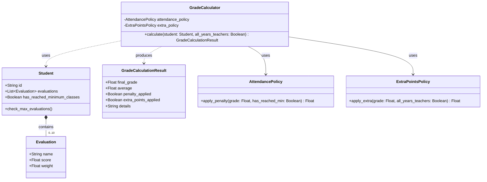

# CS-GradeCalculator

Sistema de cálculo de notas finales para docentes de UTEC, implementado con FastAPI, PostgreSQL y Docker, siguiendo principios de diseño orientado a objetos y clean code.

## Características

- **Registro de Evaluaciones**: Permite registrar notas y pesos (RF01).
- **Control de Asistencia**: Aplica penalizaciones si no se cumple el mínimo (RF02).
- **Puntos Extra**: Política configurable para otorgar puntos adicionales (RF03).
- **Cálculo Determinista**: Garantiza resultados consistentes (RF04, RNF03).
- **Alta Concurrencia**: Soporta múltiples solicitudes simultáneas (RNF02).
- **Calidad de Código**: Integración con SonarQube para análisis estático.

## Arquitectura y Diseño (UML)

El sistema sigue una arquitectura por capas con un dominio rico. A continuación se presenta el diagrama de clases:



## Requisitos Previos

- Docker y Docker Compose

## Instrucciones de Ejecución

1. **Clonar el repositorio**
2. **Iniciar los servicios**
   ```bash
   docker compose up -d --build
   ```
3. **Acceder a la API**
   - Swagger UI: [http://localhost:8000/docs](http://localhost:8000/docs)
4. **Ejecutar Análisis de Calidad (SonarQube)**
   ```bash
   docker compose run --rm sonar-scanner
   ```

## Endpoints Principales

- `POST /students/{id}`: Crear estudiante.
- `POST /students/{id}/evaluations`: Agregar evaluación.
- `PUT /students/{id}/attendance`: Actualizar asistencia.
- `POST /calculate/{id}`: Calcular nota final.
